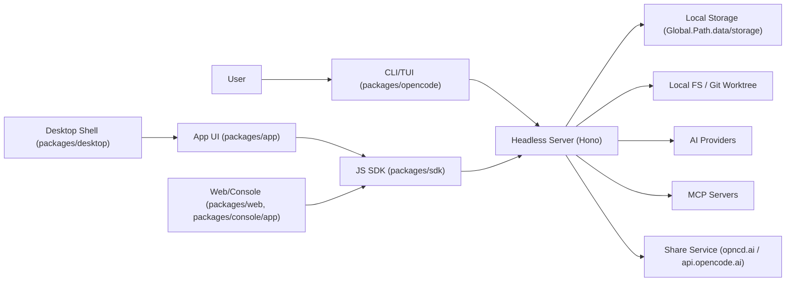
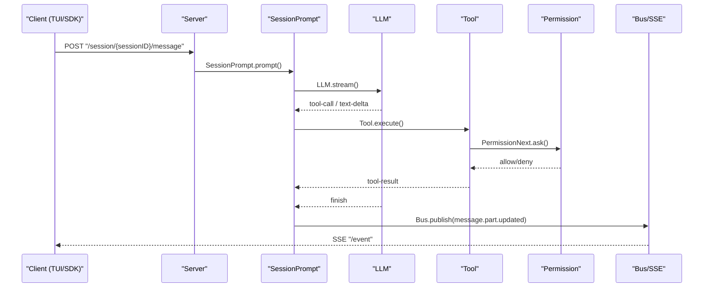

# OpenCode 设计文档（仓库级）

生成日期：2026-02-05

## 1. 范围与依据
- 本文基于仓库 `dev` 分支代码与目录结构，覆盖 CLI/TUI + Server + Session/Tool/Provider/MCP 等核心运行时，主要聚焦 `packages/opencode`。
- 其他包以“角色/边界/技术栈”说明为主，避免过度展开业务细节。
- 关键引用以文件路径为主，便于定位与进一步核查。

## 2. 仓库总体结构
- `packages/opencode`：核心运行时与 CLI/TUI；入口 `packages/opencode/src/index.ts`，Server `packages/opencode/src/server/server.ts`。
- `packages/sdk`：OpenAPI 规范与 JS SDK。OpenAPI `packages/sdk/openapi.json`，JS SDK `packages/sdk/js/src/v2/client.ts`。
- `packages/app`：主 UI（Solid + Vite）。
- `packages/desktop`：Tauri 桌面壳，内嵌 `@opencode-ai/app`。
- `packages/ui`：共享 UI 组件/主题/样式。
- `packages/web`：Astro 文档/网站（Starlight）。
- `packages/docs`：文档内容与 OpenAPI 资源，供站点构建使用。
- `packages/console`：云端控制台多包结构，`packages/console/app` 为 SolidStart 前端，`packages/console/core`/`mail`/`resource`/`function` 提供共享能力。
- `packages/enterprise`：企业版前端（SolidStart + Hono），含企业部署相关逻辑。
- `packages/slack`：Slack 集成（Bolt + SDK）。
- `packages/function`：云端函数/服务（Hono + Octokit + Jose）。
- `packages/plugin`：插件 SDK 与 Tool 接口。
- `packages/util`：共享工具库。
- `packages/script`：仓库级脚本库。
- `packages/containers`：容器镜像/构建脚本。
- `packages/extensions`：编辑器扩展（当前含 Zed 扩展）。
- `packages/identity`：品牌/标识资源。
- 其他顶层目录：`infra`、`install`、`nix`、`themes`、`specs`、`sdks` 等用于基础设施、安装与主题/规范资产。

## 3. 整体框架（架构视图）

关键代码：`packages/opencode/src/index.ts`、`packages/opencode/src/server/server.ts`、`packages/sdk/js/src/v2/client.ts`

说明：CLI/TUI 与 Server 的通信既可走 HTTP，也可在本地通过 Worker RPC + 内部 `fetch`（无端口）完成。

## 4. 核心运行时设计（packages/opencode）

### 4.1 CLI/TUI 入口
- CLI 入口：`packages/opencode/src/index.ts`，使用 yargs，初始化日志与环境变量（`OPENCODE`/`AGENT`），并注册命令。
- 已注册命令（非穷尽细节）：`acp`、`mcp`、`attach`、`run`、`generate`、`debug`、`auth`、`agent`、`upgrade`、`uninstall`、`serve`、`web`、`models`、`stats`、`export`、`import`、`github`、`pr`、`session`，默认命令为 TUI（`$0`）。
- `run`：`packages/opencode/src/cli/cmd/run.ts`，优先使用 SDK 调用本地 Server 的 `Server.App().fetch`（无 HTTP 端口），若 `--attach` 则直连远端 `baseUrl`。
- `serve`：`packages/opencode/src/cli/cmd/serve.ts`，调用 `Server.listen` 启动 Hono Server，支持端口/主机/mDNS/CORS；若未设置 `OPENCODE_SERVER_PASSWORD` 会警告。
- TUI 入口：`packages/opencode/src/cli/cmd/tui/thread.ts`，默认命令 `$0`；启动 Worker（优先 dist worker），通过 RPC 访问核心逻辑。
- TUI 的通信模式：当显式设置端口/主机/mDNS 或配置要求时启动 HTTP Server；否则走 RPC + 内部 `fetch` 与 RPC EventSource（无 HTTP 端口）。
- `attach`：`packages/opencode/src/cli/cmd/tui/attach.ts`，支持附加到远端 Server，并可提供 basic auth 头。
- TUI UI：`packages/opencode/src/cli/cmd/tui/app.tsx`，使用 OpenTUI + Solid 组件树渲染。

### 4.2 Instance / Project 上下文
- `Instance.provide()` 以“目录”为维度缓存上下文，包含 `directory`、`worktree`（当前 sandbox 目录）与 `project`，并可注入 `InstanceBootstrap` 初始化。见 `packages/opencode/src/project/instance.ts`。
- `Project.fromDirectory()` 负责 Git 根目录识别、project id 生成（根 commit），并维护 `worktree` 与 `sandboxes` 列表。见 `packages/opencode/src/project/project.ts`。
- 非 Git 目录会使用 project id `global`，`worktree` 为 `/`，以避免外部目录权限误判。见 `Project.fromDirectory()` 与 `Instance.containsPath()`。
- `InstanceBootstrap()` 初始化 Plugin、Share、ShareNext、Format、LSP、FileWatcher、File、VCS、Snapshot、Truncate，并监听 `Command.Event.Executed` 标记项目初始化。见 `packages/opencode/src/project/bootstrap.ts`。

### 4.3 Server (Hono)
- Server 基于 Hono，包含 NamedError/HTTPException 处理、basic auth、CORS 以及请求日志。见 `packages/opencode/src/server/server.ts`。
- 每次请求通过 `Instance.provide()` 绑定上下文，目录来自 query `directory`。见 `packages/opencode/src/server/server.ts`。
- 核心路由模块：`/project`、`/pty`、`/config`、`/experimental`、`/session`、`/permission`、`/question`、`/provider`、`/mcp`、`/tui`、`/global`、`/find`、`/file`。见 `packages/opencode/src/server/routes/*`。
- 额外端点：`/auth/{providerID}`（PUT/DELETE）、`/instance/dispose`、`/path`、`/vcs`、`/command`、`/log`、`/agent`、`/skill`、`/lsp`、`/formatter`。
- SSE：`/event` 使用 `streamSSE` 推送 `Bus` 所有事件，连接时发送 `server.connected`，每 30s 发送 `server.heartbeat`，实例释放时自动关闭。见 `packages/opencode/src/server/server.ts`。
- `Server.listen()` 使用 Bun.serve 启动（默认尝试 4096），可发布 mDNS（非回环地址）并维护 CORS 白名单。见 `packages/opencode/src/server/server.ts`。

### 4.4 Event Bus
- `Bus` 为实例内事件总线，`GlobalBus` 为跨实例事件。见 `packages/opencode/src/bus/index.ts` 与 `packages/opencode/src/bus/global.ts`。
- `Bus.InstanceDisposed` 用于 SSE 断开与实例清理协作。见 `packages/opencode/src/bus/index.ts`。

### 4.5 配置系统
- 配置合并顺序（低到高优先级）：
- 远程 `.well-known/opencode`（通过 Auth 中 `wellknown` 类型注入）。
- 全局配置 `~/.config/opencode/opencode.json{,c}`。
- 自定义配置路径 `OPENCODE_CONFIG`。
- 项目配置 `opencode.json{,c}`（向上查找）。
- `.opencode` 目录配置（项目/全局/用户 home），以及可选 `OPENCODE_CONFIG_DIR`。
- 内联配置 `OPENCODE_CONFIG_CONTENT`。
- 受管配置目录（企业级）`/Library/Application Support/opencode`、`/etc/opencode`、`%ProgramData%\opencode`。
- `.opencode` 目录除 `opencode.json{,c}` 外，还会扫描 `commands/`、`agents/`、`modes/`、`plugins/`，并按需在目录内自动安装 `@opencode-ai/plugin`。见 `packages/opencode/src/config/config.ts`。
- 配置覆盖支持 Provider、MCP、LSP、Formatter、Permission、Share、Instructions、Skills 等。见 `packages/opencode/src/config/config.ts`。

### 4.6 数据存储（Storage）
- 存储基于 JSON 文件，目录为 `Global.Path.data/storage`，并带有锁与迁移机制。见 `packages/opencode/src/storage/storage.ts`。
- 典型 key：`["project", projectID]` 存项目信息。
- 典型 key：`["session", projectID, sessionID]` 存会话信息。
- 典型 key：`["message", sessionID, messageID]` 存消息。
- 典型 key：`["part", messageID, partID]` 存消息分片。
- 典型 key：`["session_diff", sessionID]` 存会话 diff。
- 典型 key：`["session_share", sessionID]` 存分享信息。
- 典型 key：`["todo", sessionID]` 存 todo 列表。

### 4.7 Session / Message / Part
- `Session.Info` 包含 `id/slug/projectID/directory/parentID/title/version/time/permission/revert/summary/share` 等字段。见 `packages/opencode/src/session/index.ts`。
- `MessageV2` 支持 `User`/`Assistant`，Part 类型包括 `text`、`reasoning`、`file`、`tool`、`snapshot`、`patch`、`agent`、`compaction`、`subtask`、`retry`、`step-start`、`step-finish` 等。见 `packages/opencode/src/session/message-v2.ts`。
- `SessionPrompt.prompt()` 负责创建用户消息、合并权限、驱动 `SessionProcessor` 与 `LLM.stream()` 流式输出。见 `packages/opencode/src/session/prompt.ts` 与 `packages/opencode/src/session/processor.ts`。
- 事件：`session.created/updated/deleted/diff/error`，`message.updated/removed/message.part.updated/message.part.removed`。见 `packages/opencode/src/session/index.ts` 与 `packages/opencode/src/session/message-v2.ts`。

### 4.8 Agent / Command / Plugin / Skill
- Agent 定义在 `packages/opencode/src/agent/agent.ts`，内置 `build/plan/general/explore/compaction/title/summary` 等 agent，并可由配置覆盖或新增。
- Command 通过 Markdown 文件加载（`commands/` 或 `command/`），被 Server `/command` 与 CLI 使用。见 `packages/opencode/src/command` 与 `packages/opencode/src/config/config.ts`。
- Plugin 来自 `Config.plugin` 与 `.opencode/plugins/`，支持 hooks（例如 `chat.params`、`chat.headers`、`tool.execute.before/after`、`shell.env`、`experimental.chat.system.transform` 等）。见 `packages/opencode/src/plugin`。
- Skill 扫描来源包括 `.opencode/skill(s)`、外部 `.claude/skills` 与 `.agents/skills`、以及 `config.skills.paths` 额外目录；技能由 `skill` 工具加载并受权限控制。见 `packages/opencode/src/skill/skill.ts` 与 `packages/opencode/src/tool/skill.ts`。

## 5. LLM 与 Provider 体系

### 5.1 Provider 加载与模型选择
- Provider 数据基于 `models.dev`（本地缓存 + 远程刷新），并叠加配置、环境变量、Auth 以及插件扩展。见 `packages/opencode/src/provider/models.ts` 与 `packages/opencode/src/provider/provider.ts`。
- 内置 SDK 覆盖 `@ai-sdk/*`、`@openrouter/ai-sdk-provider`、`@gitlab/gitlab-ai-provider` 以及 GitHub Copilot 适配。见 `BUNDLED_PROVIDERS`。
- `Provider.defaultModel()` 优先使用配置 `model`，否则在已启用 Provider 中按优先级（`gpt-5`、`claude-sonnet-4`、`big-pickle`、`gemini-3-pro`）与 `latest` 规则排序选取。见 `packages/opencode/src/provider/provider.ts`。

### 5.2 LLM 运行与系统提示
- `LLM.stream()` 使用 `ai.streamText`，组装系统提示、provider options、tool schema，并通过插件 hooks 扩展参数与头。见 `packages/opencode/src/session/llm.ts`。
- System prompt 由 `SystemPrompt` 与 `InstructionPrompt.system()` 生成，并支持 `experimental.chat.system.transform` 注入。见 `packages/opencode/src/session/system.ts`、`packages/opencode/src/session/instruction.ts`。
- 对 Codex（OpenAI OAuth）走 `options.instructions` 特殊路径，其余 Provider 使用统一 headers（包含 `x-opencode-*` 追踪信息）。见 `packages/opencode/src/session/llm.ts`。

## 6. Tool 体系

### 6.1 Tool 注册与分发
- ToolRegistry 聚合内置工具、`.opencode/tools` 自定义工具、插件工具，并在特定条件下动态启用。见 `packages/opencode/src/tool/registry.ts`。
- 内置工具包含 `bash/read/list/glob/grep/edit/write/task/webfetch/todowrite/websearch/codesearch/skill/apply_patch` 等；`question` 仅在 `app/cli/desktop` 客户端启用；`lsp`/`batch`/`plan_enter`/`plan_exit` 受 flag 或配置控制。见 `packages/opencode/src/tool/registry.ts`。
- 部分 GPT 模型会切换为 `apply_patch` 工具并禁用 `edit/write`（`gpt-*` 且非 `gpt-4`/`oss`）。见 `packages/opencode/src/tool/registry.ts`。
- `Tool.define()` 统一参数校验与输出截断（默认走 `Truncate.output`），除非工具自行标记 `truncated`。见 `packages/opencode/src/tool/tool.ts`。

### 6.2 文件与编辑工具
- `read`：支持 offset/limit，限制 2000 行与 50KB，支持图片/PDF 作为附件返回，并加载周边指令（AGENTS/CLAUDE）。见 `packages/opencode/src/tool/read.ts`。
- `edit`：基于 old/new 替换，生成 diff，触发 LSP 诊断与 FileWatcher 事件，权限为 `edit`。见 `packages/opencode/src/tool/edit.ts`。
- `write`：直接写文件，生成 diff，触发 LSP 诊断与 FileWatcher 事件，权限为 `edit`。见 `packages/opencode/src/tool/write.ts`。
- `apply_patch`：支持 add/update/delete/move，解析补丁并生成 diff，触发 LSP 诊断与 FileWatcher 事件，权限为 `edit`。见 `packages/opencode/src/tool/apply_patch.ts`。

### 6.3 Bash 与外部目录权限
- `bash` 工具通过 Tree-sitter 解析命令，推断路径影响并申请权限（`bash` 与 `external_directory`）。见 `packages/opencode/src/tool/bash.ts`。
- `external_directory` 权限由 `assertExternalDirectory` 强制，依赖 `Instance.containsPath()`。见 `packages/opencode/src/tool/external-directory.ts`。

### 6.4 其它工具与限制
- `task`：创建子会话执行子任务，受 `task` 权限与 agent 权限约束。见 `packages/opencode/src/tool/task.ts`。
- `skill`：加载技能内容并返回 `<skill_content>` 块，同时列出采样文件。见 `packages/opencode/src/tool/skill.ts`。
- `batch`：最多并行 25 个内置工具调用，禁用 MCP 工具与 `batch` 自身。见 `packages/opencode/src/tool/batch.ts`。
- `plan_enter`/`plan_exit`：通过 Question 切换 plan/build agent，并写入计划文件。见 `packages/opencode/src/tool/plan.ts`。
- `websearch`/`codesearch` 仅在 `opencode` provider 或 `OPENCODE_ENABLE_EXA` 下启用。见 `packages/opencode/src/tool/registry.ts`。

### 6.5 输出截断
- `Truncate.output()` 默认限制 2000 行与 50KB，完整输出写入 `Global.Path.data/tool-output`，并由 Scheduler 每小时清理 7 天前文件。见 `packages/opencode/src/tool/truncation.ts`。

## 7. 权限与提问系统

### 7.1 Permission
- Permission 使用 allow/deny/ask，支持通配符与路径扩展（`~`/`$HOME`）。见 `packages/opencode/src/permission/next.ts`。
- `PermissionNext.ask()` 生成 pending 请求，事件 `permission.asked`；通过 API `POST /permission/{requestID}/reply` 提交 `once/always/reject`（接口返回 `boolean`）。见 `packages/opencode/src/server/routes/permission.ts`。
- `edit` 权限统一覆盖 `edit/write/apply_patch` 等编辑类工具。见 `PermissionNext.disabled()`。

### 7.2 Question
- Question 支持单选/多选，事件 `question.asked/replied/rejected`，API `POST /question/{requestID}/reply` 与 `POST /question/{requestID}/reject`。见 `packages/opencode/src/question/index.ts` 与 `packages/opencode/src/server/routes/question.ts`。

## 8. MCP (Model Context Protocol)
- MCP 支持 `stdio`、`SSE`、`Streamable HTTP` 传输与 OAuth 流程，状态含 `connected/disabled/failed/needs_auth/needs_client_registration`。见 `packages/opencode/src/mcp/index.ts`。
- Server 路由支持 `mcp.status`、`mcp.add`、`mcp.connect/disconnect` 以及 OAuth start/callback/authenticate/remove。见 `packages/opencode/src/server/routes/mcp.ts`。
- MCP 工具在 `SessionPrompt.resolveTools()` 中被包装为 AI SDK Tool，并统一接入权限与插件 hooks。见 `packages/opencode/src/session/prompt.ts`。

## 9. 文件变更、LSP 与格式化
- FileWatcher 基于 `@parcel/watcher`，按平台选择 backend，监听 git 目录与可选工作区目录，受 flags 与 `config.watcher.ignore` 控制。见 `packages/opencode/src/file/watcher.ts`。
- LSP 按文件扩展动态启动 server，支持配置覆盖与实验开关（如 `OPENCODE_EXPERIMENTAL_LSP_TY`）。见 `packages/opencode/src/lsp/index.ts`。
- Formatter 订阅 `File.Event.Edited`，按扩展匹配配置命令执行。见 `packages/opencode/src/format/index.ts`。

## 10. Snapshot、Revert 与 Summary
- Snapshot 使用独立 git 目录 `Global.Path.data/snapshot/<projectID>` 跟踪状态，支持 `track/patch/diff/restore/revert`，并定时 `git gc --prune=7.days` 清理。见 `packages/opencode/src/snapshot/index.ts`。
- `SessionRevert` 根据 message/part 定位回退点，调用 Snapshot 恢复并清理消息与 diff。见 `packages/opencode/src/session/revert.ts`。
- `SessionSummary` 计算会话 diff，并在必要时由 `title` agent 生成标题。见 `packages/opencode/src/session/summary.ts`。
- `SessionCompaction` 根据 token 预算触发压缩，`prune` 会标记历史 tool 输出并受阈值保护。见 `packages/opencode/src/session/compaction.ts`。

## 11. Worktree
- 支持 Git worktree 创建/删除/重置，自动生成 `opencode/<name>` 分支，并可运行项目/工作区启动脚本。见 `packages/opencode/src/worktree/index.ts`。

## 12. Share
- `ShareNext` 基于事件增量同步 `session/message/part/session_diff/model` 到分享服务（默认 `https://opncd.ai`），自动缓存与批量同步。见 `packages/opencode/src/share/share-next.ts`。
- `Share` 为旧版同步实现，默认指向 `api.opencode.ai` 或 `api.dev.opencode.ai`。见 `packages/opencode/src/share/share.ts`。

## 13. PTY 与 Shell
- PTY 使用 `bun-pty`，支持 WebSocket 订阅、缓冲、resize 与 write。见 `packages/opencode/src/pty/index.ts`。
- Shell 选择优先 `SHELL`，黑名单 `fish/nu`，并提供 kill-tree 逻辑。见 `packages/opencode/src/shell/shell.ts`。

## 14. SDK 与客户端接入
- JS SDK 通过 OpenAPI 生成 `OpencodeClient`，通过 `directory` 参数绑定上下文目录。见 `packages/sdk/js/src/v2/client.ts`。
- CLI/TUI 与 App/UI 通过 SDK 调用 Server 接口（HTTP 或内部 fetch）。见 `packages/opencode/src/cli/cmd/run.ts` 与 `packages/opencode/src/cli/cmd/tui/thread.ts`。

## 15. 关键业务流程

### 15.1 启动 TUI/CLI
1. CLI 入口解析参数、初始化日志与环境标识。见 `packages/opencode/src/index.ts`。
2. 默认进入 TUI：启动 Worker，选择 HTTP Server 或 RPC + 内部 `fetch`。见 `packages/opencode/src/cli/cmd/tui/thread.ts`。
3. Worker 初始化 `InstanceBootstrap`，启动 Plugin/LSP/Watcher 等。见 `packages/opencode/src/project/bootstrap.ts`。
4. UI 通过 SDK 订阅 SSE `/event` 或 RPC EventSource 获取实时消息与状态。见 `packages/opencode/src/server/server.ts`。

### 15.2 Prompt 与回复生成（核心流程）

关键代码：`packages/opencode/src/session/prompt.ts`、`packages/opencode/src/session/processor.ts`、`packages/opencode/src/session/llm.ts`

### 15.3 工具调用与权限
- `SessionPrompt.resolveTools()` 合并 `Agent.permission` 与 `Session.permission`，并注入到 `ctx.ask()`；MCP 工具也走同样权限流。见 `packages/opencode/src/session/prompt.ts`。
- 编辑类工具统一使用 `permission: "edit"`，并在工具内部再次检查外部目录权限。见 `packages/opencode/src/tool/edit.ts`、`packages/opencode/src/tool/write.ts`、`packages/opencode/src/tool/apply_patch.ts`。

### 15.4 会话压缩与剪枝
- `SessionCompaction.isOverflow()` 按模型 token 上限判断是否需要压缩。见 `packages/opencode/src/session/compaction.ts`。
- `SessionCompaction.prune()` 将旧 tool 输出标记为 compacted，减少上下文膨胀。见 `packages/opencode/src/session/compaction.ts`。

### 15.5 会话 revert
- `SessionRevert.revert()` 通过 Snapshot 恢复文件状态，并修剪后续消息/parts。见 `packages/opencode/src/session/revert.ts`。

### 15.6 MCP 认证流程
- OAuth 通过 `McpOAuthProvider` + `McpOAuthCallback` 实现，完成后可重新 `connect/add` 刷新工具列表。见 `packages/opencode/src/mcp/index.ts` 与 `packages/opencode/src/server/routes/mcp.ts`。

## 16. 风险点与可演进方向（基于代码观察）
- SSE 与 Bus 是核心依赖；多实例与 instance dispose 的边界需要持续测试。见 `packages/opencode/src/bus/index.ts`、`packages/opencode/src/server/server.ts`。
- 权限规则 “always” 当前主要保存在内存，缺少持久化管理界面。见 `packages/opencode/src/permission/next.ts`。
- Tool 输出截断会将完整结果写入本地 `tool-output`，需关注隐私与磁盘治理策略。见 `packages/opencode/src/tool/truncation.ts`。
- Snapshot 基于独立 git 目录与 `git gc` 清理，对大型仓库可能带来性能成本。见 `packages/opencode/src/snapshot/index.ts`。

## 17. 附录：核心文件导航
- CLI / TUI 入口：`packages/opencode/src/index.ts`，`packages/opencode/src/cli/cmd/*`
- Server 与路由：`packages/opencode/src/server/server.ts`，`packages/opencode/src/server/routes/*`
- Session 与消息：`packages/opencode/src/session/*`
- Provider / LLM：`packages/opencode/src/provider/*`，`packages/opencode/src/session/llm.ts`
- Tool / Permission：`packages/opencode/src/tool/*`，`packages/opencode/src/permission/next.ts`
- MCP：`packages/opencode/src/mcp/index.ts`
- Storage / Snapshot：`packages/opencode/src/storage/storage.ts`，`packages/opencode/src/snapshot/index.ts`
- SDK：`packages/sdk/js/src/v2/client.ts`
