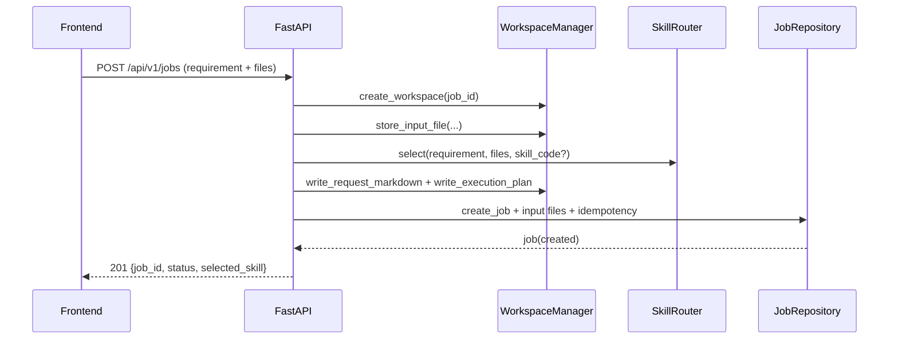
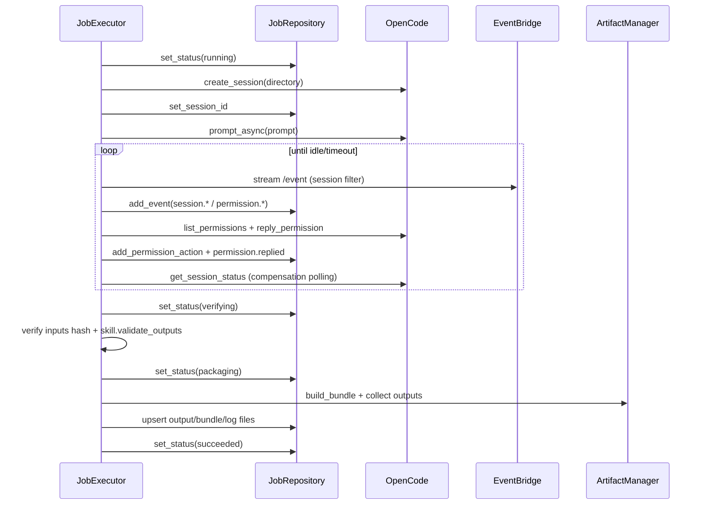

# OpenCode Orchestrator 后端整体设计（当前实现版）

## 1. 文档目标与范围

本文档描述 `services/orchestrator` 当前代码实现下的后端架构、关键流程、状态机和运行策略，作为开发与联调的基线设计文档。

- 技术栈：FastAPI + Celery + Redis + SQLAlchemy + httpx
- 执行内核：OpenCode Server（HTTP API）
- 设计原则：统一流水线、Skill 模块化、工作区隔离、状态机收敛
- 兼容策略：以当前实现为准，不保留旧协议兼容层

代码基线：

- API 入口：`services/orchestrator/app/main.py`
- 应用编排：`services/orchestrator/app/application/*`
- Worker 执行：`services/orchestrator/app/worker/*`
- 基础设施：`services/orchestrator/app/infra/*`
- 数据迁移：`services/orchestrator/migrations/001_init.sql`
- 回归测试：`services/orchestrator/tests/*`

---

## 2. 系统总览

### 2.1 运行时拓扑

```mermaid
flowchart LR
    FE["Agents Frontend"] -->|HTTP /api/v1| API["FastAPI API"]
    API -->|读写| PG["PostgreSQL / SQLite"]
    API -->|enqueue| R["Redis (broker+backend)"]
    R --> WK["Celery Worker"]
    WK -->|读写| PG
    WK -->|HTTP| OC["OpenCode Server"]
    WK -->|读写| FS["Workspace DATA_ROOT/<job_id>"]
    API -->|SSE /jobs/{id}/events| FE
```

### 2.2 分层与职责映射

| 分层 | 主要模块 | 核心职责 |
| --- | --- | --- |
| 接口层 | `app/api/v1/jobs.py` `app/api/v1/skills.py` | 参数校验、HTTP 错误语义、SSE 输出、下载响应 |
| 应用层 | `app/application/orchestrator.py` `app/application/executor.py` | 任务创建/启动/终止、状态推进、执行编排 |
| 领域层 | `app/domain/*` | 状态枚举、`JobContext`、Skill 抽象和评分路由 |
| 基础设施层 | `app/infra/db/*` `app/infra/opencode/*` `app/infra/storage/*` `app/infra/security/*` | 持久化、OpenCode 交互、工作区/打包、权限决策 |
| 异步层 | `app/worker/*` | Celery 配置、任务执行、连接错误重试 |

### 2.3 生命周期与资源管理

- API 进程使用 FastAPI `lifespan`：
  - 启动：`init_db()` 创建表结构（SQLAlchemy metadata）
  - 关闭：`shutdown_container_resources()` 回收客户端连接并清理依赖缓存
- Worker 进程通过 `worker_process_shutdown` 调用同一套资源回收逻辑。
- 依赖容器采用 `@lru_cache(maxsize=1)` 单例复用：
  - `OpenCodeClient`、`OpenCodeEventBridge`、`JobRepository`、`OrchestratorService`、`JobExecutor`。

---

## 3. 工作区与文件模型

每个任务独享目录：`DATA_ROOT/{job_id}`。

```text
{job_id}/
  job/
    request.md
    execution-plan.json
  inputs/
  outputs/
  logs/
    opencode-last-message.md
  bundle/
    manifest.json
    result.zip
```

关键约束：

- 上传文件只落盘到 `inputs/`，文件名经过 `Path(filename).name` + 正则白名单清洗。
- 输出验收目录固定为 `outputs/`，Skill 验收失败会导致任务失败。
- 打包结果固定为 `bundle/result.zip`，并内嵌 `manifest.json`。
- 上传同名文件自动追加 `_1/_2/...` 后缀，避免覆盖。

---

## 4. 数据模型与约束

### 4.1 逻辑实体

- `jobs`：任务主记录，含状态、路由技能、模型参数、错误信息、工作区路径。
- `job_files`：任务文件索引，按 `input/output/bundle/log` 分类记录哈希与尺寸。
- `job_events`：任务事件流（API/Worker/OpenCode 统一落库）。
- `permission_actions`：权限请求自动应答审计记录。
- `idempotency_records`：幂等映射表，避免重复创建任务。

### 4.2 关键约束

- 幂等唯一约束：`(tenant_id, idempotency_key, requirement_hash)`。
- 关联清理：`job_files/job_events/permission_actions/idempotency_records` 全部 `ON DELETE CASCADE`。
- 查询索引：
  - `jobs(status, created_at)`、`jobs(tenant_id, created_at)`、`jobs(session_id)`
  - `job_files(job_id, category)`
  - `job_events(job_id, created_at)`
  - `permission_actions(job_id, request_id)`

### 4.3 多租户边界（当前实现）

- Schema 层支持 `tenant_id`。
- v1 运行默认单租户：
  - `default_tenant_id = "default"`
  - `default_created_by = "system"`

---

## 5. 状态机设计

状态枚举：

`created -> queued -> running -> waiting_approval -> verifying -> packaging -> succeeded | failed | aborted`

### 5.1 转移规则

| 当前状态 | 目标状态 | 触发点 | 说明 |
| --- | --- | --- | --- |
| `created` | `queued` | `POST /jobs/{id}/start` | API 验证 OpenCode 健康后入队 |
| `failed` | `queued` | `POST /jobs/{id}/start` | 允许失败任务重试执行 |
| `queued` | `running` | Worker 执行开始 | `JobExecutor.run()` |
| `running` | `waiting_approval` | 发现 pending permission | 超过阈值会超时失败 |
| `waiting_approval` | `running` | permission 清空 | 执行恢复 |
| `running` | `verifying` | 会话完成（idle） | 拉取最后消息后进入验收 |
| `verifying` | `packaging` | 输入哈希与输出契约校验通过 | 继续打包 |
| `packaging` | `succeeded` | 产物索引写回成功 | 执行完成 |
| `*` | `failed` | 异常 | 写入 `error_code/error_message` |
| `*` | `aborted` | 人工中止或执行中检测中止 | 终态 |

### 5.2 强约束

- `aborted` 是不可逆终态：`set_status()` 禁止 `aborted -> 非aborted`。
- Worker 在关键步骤调用 `_ensure_not_aborted()` 与 `_set_status_or_abort()`，保证中止优先级。

---

## 6. API 契约（对前端）

统一前缀：`/api/v1`。

### 6.1 通用行为

- 健康检查：
  - `GET /health`
  - `GET /healthz`（兼容）
- 请求追踪：
  - 接收 `X-Request-Id`，若缺失自动生成 UUID 并回写响应头。
- CORS：
  - `CORS_ALLOWED_ORIGINS` 为空时不挂载 CORS 中间件。

### 6.2 Job 接口

| 接口 | 方法 | 作用 | 主要返回码 |
| --- | --- | --- | --- |
| `/jobs` | `POST` | 创建任务（multipart） | `201/400/404` |
| `/jobs/{job_id}/start` | `POST` | 入队执行 | `200/404/409/503` |
| `/jobs/{job_id}` | `GET` | 查询任务详情 | `200/404` |
| `/jobs/{job_id}/events` | `GET` | SSE 事件流 | `200/404` |
| `/jobs/{job_id}/abort` | `POST` | 中止任务 | `200/400/404` |
| `/jobs/{job_id}/artifacts` | `GET` | 产物列表 | `200/404` |
| `/jobs/{job_id}/download` | `GET` | 下载打包文件 | `200/404` |
| `/jobs/{job_id}/artifacts/{artifact_id}/download` | `GET` | 下载单产物 | `200/404` |

创建任务参数约束：

- `requirement` 必填且非空白。
- `files[]` 必填且至少 1 个。
- `model_provider_id` 与 `model_id` 必须成对出现，否则 `400`。
- `output_contract` 必须是合法 JSON 字符串，否则 `400`。

### 6.3 Skills 接口

- `GET /skills`：支持按 `task_type` 过滤。
- `GET /skills/{skill_code}`：返回技能描述和样例 `output_contract`。

### 6.4 SSE 事件语义

事件源为 DB 中的 `job_events`，不是直接透传 OpenCode 流。

- `event: <event_type>`
- `data` 示例字段：
  - `job_id`
  - `status`
  - `source`（`api|worker|opencode`）
  - `event_type`
  - `message`
  - `payload`
  - `created_at`

连接特性：

- 无新增事件时输出 `: keep-alive` 注释帧。
- 当任务进入终态且连续空闲轮询达到阈值后自动结束流。

---

## 7. 关键流程

### 7.1 创建任务流程（Create Job）



关键点：

- 幂等命中返回已有任务，不重复创建工作区和 DB 记录。
- 自动路由低分回退 `general-default`，并写入 `skill.router.fallback` 事件。

### 7.2 启动任务流程（Start Job）

1. 校验任务存在且状态在 `{created, failed}`。
2. 调用 OpenCode `GET /global/health` 做可用性探测。
3. 状态置 `queued`，投递 Celery `run_job_task.delay(job_id)`。
4. 写入 `job.enqueued` 事件（含 Celery `task_id`）。

### 7.3 Worker 执行主流程（Run Job）



失败与中止：

- 任意异常：置 `failed` 并写入 `job.failed`。
- 检测到中止：抛 `JobAbortedError`，最终置 `aborted` 并写入 `job.aborted`。

### 7.4 权限处理流程（Permission）

- Worker 周期查询 `list_permissions()`。
- `PermissionPolicyEngine` 决策：
  - 工作区内 file/edit/write：`once`
  - 工作区外路径：`reject`
  - 含高风险 shell token：`reject`
  - shell 权限默认：`reject`
- 应答后写入 `permission_actions` 与 `permission.replied` 事件。

### 7.5 产物生成流程（Artifacts）

- `collect_output_entries()` 收集 `outputs/**` 文件。
- `build_manifest()` 产出包含路径、大小、sha256 的 `manifest.json`。
- `build_bundle()` 打包：
  - `outputs/**`
  - `job/execution-plan.json`
  - `job/request.md`
  - `logs/opencode-last-message.md`（若存在）
  - `manifest.json`
- API 暴露层仅允许 `output` 与 `bundle` 被列出和下载。

---

## 8. Skill 模块化设计

### 8.1 抽象接口

`BaseSkill` 统一定义：

- `score(requirement, files)`
- `build_execution_plan(ctx)`
- `build_prompt(ctx, plan)`
- `validate_outputs(ctx)`
- `artifact_manifest(ctx)`

### 8.2 路由策略

- 手动指定 `skill_code` 时直接命中。
- 自动路由时对非 `general-default` 技能评分，取最高分。
- 最高分 `< SKILL_FALLBACK_THRESHOLD` 则回退 `general-default`。

### 8.3 内置技能

- `general-default`：通用兜底任务。
- `data-analysis`：表格/数据分析场景。
- `ppt`：演示文稿生成场景。

### 8.4 扩展新 Skill 的标准步骤

1. 新建 `app/domain/skills/<skill>.py` 实现五个抽象方法。
2. 在 `SkillRegistry.__init__()` 注册实例。
3. 增加对应单测（评分路由、输出校验、失败分支）。
4. 若扩展输出契约，保持 `execution-plan.json` 可回放与可审计。

---

## 9. 安全、可靠性与性能

### 9.1 上传与工作区安全

- 文件名清洗与路径截断，规避目录穿越。
- 单文件大小上限默认 50MB，空文件拒绝。
- OpenCode 所有调用都绑定 `directory` 到任务工作区。

### 9.2 幂等与一致性

- 幂等键：`tenant_id + idempotency_key + requirement_hash`。
- `requirement_hash` 由 `requirement.strip()` + `filename + sha256(content)` 计算。
- 规避“同 idempotency_key 不同文件内容”的误命中。

### 9.3 超时与重试

| 策略 | 默认值 | 实现点 |
| --- | --- | --- |
| Job soft timeout | `900s` | Celery `task_soft_time_limit` + Worker 循环截止 |
| Job hard timeout | `1200s` | Celery `task_time_limit` |
| Permission wait timeout | `120s` | `JobExecutor._sync_completion_state()` |
| OpenCode 连接异常重试 | `2` 次（30s/120s） | `run_job_task.retry()` |

### 9.4 高可用与性能细节

- OpenCode HTTP 客户端和 SSE 客户端进程级复用，减少连接抖动。
- Celery `worker_prefetch_multiplier=1` + `task_acks_late=True`，降低长任务饥饿风险。
- SSE API 中同步仓储调用通过 `asyncio.to_thread()` 下沉，避免阻塞事件循环。
- OpenCode 事件流断连时退化为状态轮询，不依赖单一路径收敛。

---

## 10. 配置与部署

### 10.1 关键配置项（`app/config.py`）

- 基础：`APP_NAME` `API_PREFIX` `ENVIRONMENT`
- 跨域：`CORS_ALLOWED_ORIGINS` `CORS_ALLOWED_METHODS` `CORS_ALLOWED_HEADERS` `CORS_ALLOW_CREDENTIALS`
- 存储与队列：`DATABASE_URL` `REDIS_URL` `DATA_ROOT`
- OpenCode：`OPENCODE_BASE_URL` `OPENCODE_SERVER_USERNAME` `OPENCODE_SERVER_PASSWORD` `OPENCODE_REQUEST_TIMEOUT_SECONDS`
- 路由与执行：`DEFAULT_AGENT` `SKILL_FALLBACK_THRESHOLD`
- 限制与超时：`MAX_UPLOAD_FILE_SIZE_BYTES` `PERMISSION_WAIT_TIMEOUT_SECONDS` `JOB_SOFT_TIMEOUT_SECONDS` `JOB_HARD_TIMEOUT_SECONDS`
- 租户默认：`DEFAULT_TENANT_ID` `DEFAULT_CREATED_BY`

说明：

- `DATA_ROOT` 不可写时会回退到 `./data/opencode-jobs`。
- `workspace_retention_hours` 当前为预留配置，尚未接入自动清理任务。

### 10.2 运行模式

- 本地开发：`uvicorn app.main:app` + `celery worker`。
- 容器编排：`docker-compose.yml` 提供 `postgres/redis/opencode/api/worker/beat`。
- 共享卷：API 与 Worker 需共享 `DATA_ROOT`，保证同一工作区可见。

---

## 11. 可观测性与排障

### 11.1 可观测数据面

- 任务状态：`jobs.status`
- 事件时间线：`job_events` + SSE `/jobs/{id}/events`
- 权限审计：`permission_actions`
- 文件产物：`job_files` + `manifest.json`

### 11.2 常见问题排查

1. 任务长期 `queued`：
   - 检查 Redis、Celery Worker 是否在线且订阅 `default` 队列。
2. 任务 `failed` 且错误为连接问题：
   - 检查 `OPENCODE_BASE_URL` 可达性与账号密码。
3. 任务卡在 `waiting_approval`：
   - 查看 `permission_actions` 与 `job_events` 中 `permission.*` 事件。
4. 下载 404：
   - 确认任务是否已完成打包且 `result_bundle_path` 文件存在。

---

## 12. 测试与质量基线

当前测试覆盖：

- `tests/test_skill_router.py`：手动覆盖、自动路由、低分回退。
- `tests/test_permission_policy.py`：工作区边界、危险命令拦截。
- `tests/test_p1_regressions.py`：
  - `requirement_hash` 包含文件内容哈希
  - `aborted` 状态不可被覆盖
  - artifact 仅暴露 `output/bundle`

建议后续补充：

- 端到端执行链路（含 OpenCode mock）；
- 幂等并发竞争场景测试；
- SSE 终止条件与 keep-alive 行为测试。

---

## 13. 非兼容说明（本版策略）

本版明确采用“直接最优设计”，不保留旧字段/旧契约兼容层：

- `jobs.model` 已替换为 `jobs.model_json`
- `POST /jobs` 不再接收单字符串 `model`
- 幂等唯一约束采用三元键，不再使用旧二元键

如需部署到已有旧库，建议重建数据库或执行一次性迁移后上线。

---

## 14. 已知限制与演进方向

当前限制：

- 默认单租户运行，租户鉴权链路未在 API 层落地。
- `workspace_retention_hours` 尚未落地自动回收策略。
- 事件持久化为关系型表，尚未拆分为独立事件总线。

演进建议：

1. 引入定时清理任务，按 `workspace_retention_hours` 回收工作区与历史记录。
2. 增加业务级鉴权与审计字段（用户、组织、来源系统）。
3. 对 `job_events` 建立归档策略，避免热表无限增长。
