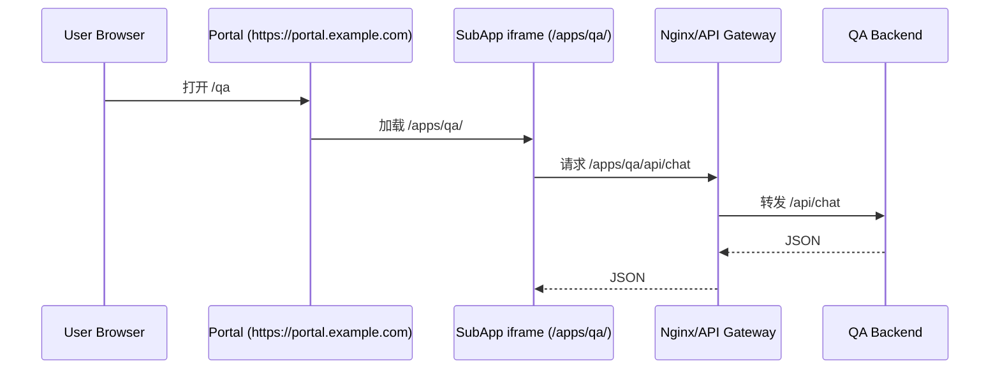
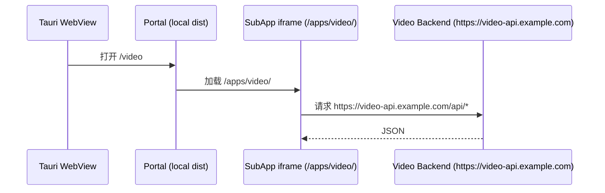

# Web / App 统一后端接入规范（Portal + 子应用）

## 1. 目标与范围

本文定义 MainAgent 系统在两种发布形态下的统一后端接入规则：

- Web 版：Portal 与子应用部署在同一域名，通过服务端网关分流。
- App 版（Tauri）：Portal 与子应用静态资源内嵌到安装包，子应用直接访问后端 API。

适用对象：

- Portal 前端（MainAgentFrontend）
- QA / Video / Agents 子应用前端
- 对应后端服务与网关
- CI/CD 与发布运维

## 2. 统一原则

1. 前端同构：同一套子应用代码同时支持 Web 与 App，不引入两套业务实现。
2. 入口解耦：Portal 仅负责导航、探活、iframe 容器，不承担业务 API 聚合逻辑。
3. 路径稳定：子应用静态入口固定为 `/apps/<appId>/`，API 统一通过 `apiBaseUrl + endpoint` 组装。
4. 最小权限：Tauri CSP、后端 CORS、网关规则均采用白名单，禁止默认全开。
5. 可回滚：发布时始终记录 Portal / QA / Video / Agents 版本组合，支持整包回滚。

## 3. 架构与责任边界

### 3.1 组件职责

- Portal：路由映射、子应用探活、桌面桥接能力（文件/系统/配置）。
- 子应用：业务 UI、业务 API 调用、业务状态管理。
- 网关（仅 Web 必需）：同域静态托管与 `/apps/*/api` 转发。
- 后端服务：对外 API、鉴权、审计、CORS 策略。

### 3.2 不做的事情

- Tauri 安装包内不部署 Nginx。
- Portal 不代理所有业务 API（保留为二阶段兜底方案，不作为首选）。

## 4. 双端请求链路

### 4.1 Web 端（同域网关）



关键点：

- 子应用 `apiBaseUrl` 可为空字符串（同源）。
- endpoint 保持 `/api/...`，由网关完成服务寻址。
- 同域下可不依赖 CORS。

### 4.2 App 端（Tauri）



关键点：

- 无本机 Nginx 反向代理。
- 子应用必须配置绝对 `apiBaseUrl`。
- 后端必须放行 Tauri 对应 Origin（按实际请求日志固化白名单）。
- `src-tauri/tauri.conf.json` 的 `connect-src` 必须包含后端域名。

## 5. 前端配置规范

### 5.1 Portal 配置规范

Portal 保持以下约束：

- 子应用入口：`/apps/qa/`、`/apps/video/`。
- 健康检查：`/apps/<appId>/health.json`。
- 开发联调可用 `VITE_APP_QA_ORIGIN` / `VITE_APP_VIDEO_ORIGIN`。
- 桌面生产态默认禁用远程子应用 origin 覆盖（离线内嵌优先）。

### 5.2 子应用 API 规范（强制）

每个子应用必须实现统一 API 组装方式：

- `apiBaseUrl`：环境变量读取，允许为空。
- endpoint：统一使用绝对路径片段，如 `/api/chat`、`/api/tasks`。
- 最终 URL：`joinUrl(apiBaseUrl, endpoint)`。

推荐环境变量：

| 变量 | 用途 | Web 建议值 | App 建议值 |
|---|---|---|---|
| `VITE_API_BASE_URL` | 业务 API 基地址 | 空字符串（走同域网关） | `https://<backend-domain>` |
| `VITE_API_TIMEOUT` | 请求超时（毫秒） | 按业务默认 | 按业务默认 |

实现要求：

1. 禁止在业务代码中硬编码完整后端域名。
2. 禁止在业务代码中直接拼接 `'/apps/<app>/api'` 以外的环境特定前缀。
3. 统一通过 API Client 封装处理 baseUrl、超时、错误转换、日志。

## 6. 后端与网关规范

### 6.1 API 契约

后端至少提供：

- 健康检查：`GET /health`
- 业务 API：`/api/*`
- 错误返回：统一 JSON 结构（含 message/code/status）

### 6.2 Web 网关规范

Web 部署保持同域分流，推荐规则：

```nginx
# QA API
location /apps/qa/api/ {
    proxy_pass http://qa-backend:8000/api/;
    proxy_set_header Host $host;
    proxy_set_header X-Real-IP $remote_addr;
    proxy_set_header X-Forwarded-For $proxy_add_x_forwarded_for;
    proxy_set_header X-Forwarded-Proto $scheme;
}

# Video API
location /apps/video/api/ {
    proxy_pass http://video-backend:8000/api/;
    proxy_set_header Host $host;
    proxy_set_header X-Real-IP $remote_addr;
    proxy_set_header X-Forwarded-For $proxy_add_x_forwarded_for;
    proxy_set_header X-Forwarded-Proto $scheme;
}
```

### 6.3 CORS 规范（App 端重点）

当子应用在 Tauri 中直接访问后端时，后端必须：

1. 放行开发 Origin（例如 `http://localhost:3000`）
2. 放行桌面端实际 Origin（从后端访问日志采集并白名单化）
3. 放行方法：`GET,POST,PUT,PATCH,DELETE,OPTIONS`
4. 放行请求头：`Authorization,Content-Type,X-Request-Id,X-Client-Platform`
5. 如需 Cookie 鉴权：必须 `Access-Control-Allow-Credentials: true`，且 Origin 不能为 `*`

### 6.4 鉴权与审计规范

- 统一使用 `Authorization: Bearer <token>`（除非业务明确要求 Cookie）。
- 每次请求附带 `X-Request-Id`，便于链路排障。
- 建议附带 `X-Client-Platform: web | desktop` 用于观测与灰度分析。

## 7. Tauri 专项规范

### 7.1 CSP

`src-tauri/tauri.conf.json` 中 `app.security.csp.connect-src` 必须包含：

- `self` + 本地开发域名（localhost）
- 生产后端域名白名单（QA/Video 实际域名）

示例（需按真实域名收敛）：

```json
"connect-src": "'self' tauri: ipc: http://localhost:* http://127.0.0.1:* https://qa-api.example.com https://video-api.example.com ws://localhost:* ws://127.0.0.1:*"
```

### 7.2 打包前环境注入

桌面构建前，必须为每个子应用注入可达的 API 基地址。

标准流程：

1. 准备子应用构建环境变量（每个子应用独立）。
2. 执行 `npm run desktop:prepare` 合并 `dist/apps/*`。
3. 执行 `npm run tauri:build` 产出安装包。

## 8. 端到端发布流程

### 8.1 Web 发布流程

1. 构建 Portal 与子应用（子应用使用 `/apps/<appId>/` basePath）。
2. 发布静态资源到网关机器对应目录。
3. 更新网关转发规则 `/apps/<appId>/api/* -> backend`。
4. 验证：首页、深链、health、业务 API。
5. 记录版本组合并打发布标签。

### 8.2 App 发布流程

1. 构建前确认后端域名、证书、CORS 白名单已生效。
2. 运行 `npm run desktop:prepare`。
3. 运行 `npm run tauri:build`。
4. 在目标环境安装并做连通性验收。
5. 记录版本组合并归档安装包。

## 9. 子应用接入清单（强制执行）

新接入子应用必须满足：

1. 支持 `VITE_BASE_PATH=/apps/<appId>/`。
2. 提供 `public/health.json`。
3. API Client 支持 `VITE_API_BASE_URL`。
4. endpoint 统一走 `/api/*` 约定。
5. 本地存储使用命名空间，避免与其他子应用冲突。
6. Cookie 使用子路径隔离（如 `/apps/<appId>/`）。

## 10. 验收标准

### 10.1 Web 验收

- `/qa`、`/video` 可访问并可刷新。
- `/apps/qa/health.json`、`/apps/video/health.json` 返回 200。
- 两个子应用业务 API 均返回成功。
- 网关日志可区分 QA / Video / Agents 后端流量。

### 10.2 App 验收

- 离线可打开 Portal 与已打包子应用静态页面。
- 联网后业务 API 可访问。
- 后端无明显 CORS 拒绝。
- Tauri 控制台无 CSP connect-src 拒绝。

## 11. 常见故障与定位

| 现象 | 优先排查项 |
|---|---|
| Web 正常，App 失败 | 后端 CORS、Tauri `connect-src`、App `VITE_API_BASE_URL` |
| App 可打开页面但 API 全部 401 | Token 注入逻辑、鉴权中间件、时钟偏差 |
| 仅 QA 失败，Video 正常 | QA 子应用构建变量、QA 后端域名、网关 QA 规则 |
| 刷新子页面 404 | 网关或子应用 SPA fallback 配置缺失 |

## 12. 版本与变更管理

- 本规范为系统级约束，涉及跨仓库协作。
- 任一仓库改动 API 基地址规则、网关前缀、鉴权头字段时，必须同步更新本文件。
- 建议在发布单中固定记录：Portal 版本、QA 版本、Video 版本、后端版本。
