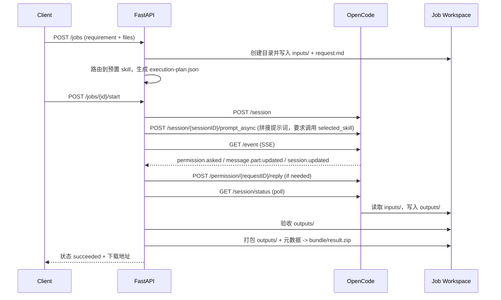

# Python FastAPI 通用编排设计（上传文件 -> Skill 执行 -> 打包返回）

本文档定义一个通用任务编排层，用于把任意“上传文件 + 文本需求”任务交给 OpenCode（Headless）处理，并返回打包产物。

核心目标：

- 不按“数据分析/PPT”写两套后端流程，而是统一成一条 Job Pipeline。
- 专用能力由后端预置 skill（与 OpenCode 同部署）执行；客户端可选传 `skill_code` 手动覆盖，不传则走自动路由。
- OpenCode 作为执行内核，FastAPI 负责上传、目录隔离、调度、状态、打包、下载。

参考文档：`docs/api/opencode-server.md`

## 1. 设计目标与边界

### 1.1 目标

- 接收用户输入（需求文本 + 文件）并创建独立任务工作区。
- 将工作区作为 OpenCode 的项目目录执行任务。
- 优先使用客户端传入的 `skill_code`（若提供），否则由后端自动选择预置 skill，并驱动 OpenCode 在该目录内完成处理。
- 产物统一沉淀到 `outputs/` 并打包下载。

### 1.2 边界

- FastAPI 负责：鉴权、上传、文件落盘、任务编排、状态持久化、产物打包分发。
- OpenCode 负责：模型推理、技能调用、文件处理、结果生成。
- 专用逻辑（如数据分析、PPT 排版）不固化在接口流程里，由“后端路由策略 + prompt 调用预置 skill”承担。

## 2. 通用工作区模型（每个 Job 一个目录）

```text
/data/opencode-jobs/{job_id}/
  job/
    request.md                # 用户需求文本
    execution-plan.json       # 后端生成：selected_skill / 输出契约 / 打包规则
  inputs/                     # 原始上传文件（保持原名）
  outputs/                    # Agent 必须写入的最终结果目录
  logs/
    opencode-last-message.md
  bundle/
    result.zip                # FastAPI 打包后的下载文件
```

约束：

- `inputs/` 只读（通过 prompt 约束 Agent 不覆盖原始文件）。
- `outputs/` 是唯一验收目录。
- `bundle/result.zip` 由 FastAPI 生成，不由 OpenCode 生成。

## 3. 通用业务 API（FastAPI）

统一前缀：`/api/v1`

1. `POST /api/v1/jobs`
- `multipart/form-data`
- 字段：
  - `requirement`（string，必填）
  - `files[]`（任意上传文件，至少 1 个）
  - `skill_code`（可选，手动覆盖技能路由）
  - `agent`（可选，默认 `build`）
  - `model_provider_id`（可选，需与 `model_id` 成对）
  - `model_id`（可选，需与 `model_provider_id` 成对）
  - `output_contract`（可选，JSON 字符串；声明必需产物）
  - `idempotency_key`（可选）
- 动作：
  - 创建 `job_id`
  - 新建工作区目录并落盘 `inputs/`、`job/request.md`
  - 若传 `skill_code` 则直接使用，否则后端自动路由（按需求文本 + 文件特征）得到 `selected_skill`
  - 生成 `job/execution-plan.json`
- 返回：`job_id`, `status=created`

2. `POST /api/v1/jobs/{job_id}/start`
- 启动异步执行。
- 返回：`status=queued`

3. `GET /api/v1/jobs/{job_id}`
- 返回任务状态、`session_id`、错误信息、产物摘要、下载地址。

4. `GET /api/v1/jobs/{job_id}/events`（SSE）
- 对外输出标准化状态流：
  - `queued`
  - `running`
  - `waiting_approval`
  - `verifying`
  - `packaging`
  - `succeeded`
  - `failed`
  - `aborted`

5. `POST /api/v1/jobs/{job_id}/abort`
- 中止任务：
  - 本地状态置 `aborted`（终态，不可覆盖）
  - 调 OpenCode：`POST /session/{sessionID}/abort`

6. `GET /api/v1/jobs/{job_id}/artifacts`
- 返回 `outputs/` 文件清单 + `bundle/result.zip` 元信息。

7. `GET /api/v1/jobs/{job_id}/download`
- 下载统一打包产物 `bundle/result.zip`。

8. `GET /api/v1/jobs/{job_id}/artifacts/{artifact_id}/download`
- 可选：下载单个产物文件。

## 4. OpenCode API 对接映射（通用）

| 步骤 | FastAPI 编排动作 | OpenCode API |
|---|---|---|
| 0 | 启动前健康检查（可选） | `GET /global/health` |
| 1 | 创建会话 | `POST /session` |
| 2 | 发送执行指令 | `POST /session/{sessionID}/prompt_async`（或 `POST /session/{sessionID}/message`） |
| 3 | 订阅执行事件 | `GET /event`（SSE） |
| 4 | 处理权限请求 | `POST /permission/{requestID}/reply` |
| 5 | 轮询会话状态 | `GET /session/status` |
| 6 | 拉取最终消息摘要 | `GET /session/{sessionID}/message?limit=1` |
| 7 | 校验目录/文本产物 | `GET /file?path=...` / `GET /file/content?path=...` |

请求参数约束：

- 所有 OpenCode 请求都携带 query 参数：
  - `directory=/data/opencode-jobs/{job_id}`
- 若启用鉴权，携带 Basic Auth（见 `OPENCODE_SERVER_PASSWORD`）。

事件处理约束：

- `/event` 是总线流，FastAPI 必须按 `session_id` 过滤再映射到 `job_id`。
- 会话结束以 `GET /session/status` 中 `sessionID` 对应状态 `type=idle` 作为准入条件，再进入验收/打包阶段。

## 5. 通用执行流程



## 6. Prompt 与 Skill 注入规范（通用）

FastAPI 组装统一 Prompt 模板，不写业务算法，仅写执行约束：

- 工作目录：`/data/opencode-jobs/{job_id}`
- 输入目录：`inputs/`
- 输出目录：`outputs/`
- 执行计划文件：`job/execution-plan.json`
- 需求文本文件：`job/request.md`
- 指定技能：`selected_skill`（后端路由后得到的预置 skill 名）

Prompt 必含规则：

- 必须先加载并执行 `selected_skill`，再处理任务。
- 必须优先遵循 `job/execution-plan.json` 的输出契约。
- 不修改 `inputs/` 原始文件。
- 处理结果只写入 `outputs/`。
- 若信息不足，采用最小合理假设并在 `outputs/README.md` 说明假设，不向外部等待人工补充。

## 7. 打包与回传规则（通用）

### 7.1 验收输入

- 基础验收：`outputs/` 非空。
- 契约验收：按 `output_contract` / `execution-plan.json` 检查必需文件（例如必须存在 `report.md` 或 `slides.pptx`）。

### 7.2 打包内容

`bundle/result.zip` 建议包含：

- `outputs/**`
- `job/execution-plan.json`
- `job/request.md`
- `logs/opencode-last-message.md`
- `manifest.json`（文件清单、大小、hash、生成时间、job_id、session_id）

### 7.3 下载策略

- 默认返回 `result.zip`（统一出口，前端无需理解任务差异）。
- 如前端需要预览，可走单文件下载接口。

## 8. 状态机（通用）

`created -> queued -> running -> waiting_approval -> verifying -> packaging -> succeeded | failed | aborted`

状态来源：

- OpenCode 事件：`permission.asked`、`message.part.updated`、`session.updated`
- OpenCode 轮询：`GET /session/status`
- FastAPI 本地动作：验收与打包结果

## 9. 数据模型（最小）

### 9.1 `jobs`

- `id` (uuid)
- `status`
- `session_id` (string)
- `workspace_dir`
- `requirement_text`
- `selected_skill`
- `agent`
- `model_json`
- `output_contract_json`
- `error_code`
- `error_message`
- `created_by`
- `created_at` / `updated_at`

### 9.2 `job_files`

- `id`
- `job_id`
- `category` (`input|output|bundle|log`)
- `relative_path`
- `mime_type`
- `size_bytes`
- `sha256`
- `created_at`

### 9.3 `permission_actions`

- `id`
- `job_id`
- `request_id`
- `action` (`once|always|reject`)
- `actor`
- `created_at`

## 10. 安全与稳定性要求

- OpenCode sidecar 必须启用 Basic Auth。
- 所有 OpenCode 请求必须显式携带 `directory` query 参数。
- 上传安全：
  - 单文件大小上限（例如 50MB）
  - 文件名规范化，防止路径穿越
  - 可选 MIME 白名单
- 执行安全：
  - 任务超时（例如 15 分钟）自动 `abort`
  - `permission` 等待超时后失败
- 存储治理：
  - 按保留期清理过期工作区与打包文件

## 11. 与具体业务的关系（示例，不是专用流程）

- 数据分析：后端路由命中预置 `data-analysis` skill，生成 `outputs/report.md` + 图表。
- PPT 制作：后端路由命中预置 `ppt` skill，生成 `outputs/slides.pptx`。

结论：后端流程不变，变化点仅在“后端选中的 `selected_skill` + execution-plan/output_contract”。

## 12. 验收标准（通用）

- 用户上传文件后，系统可创建隔离工作区并保存原始输入。
- OpenCode 可在该工作区上下文完成处理并写入 `outputs/`。
- 后端可完成验收、打包并返回可下载结果。
- 全链路可追踪：`job_id + session_id + request_id`。
