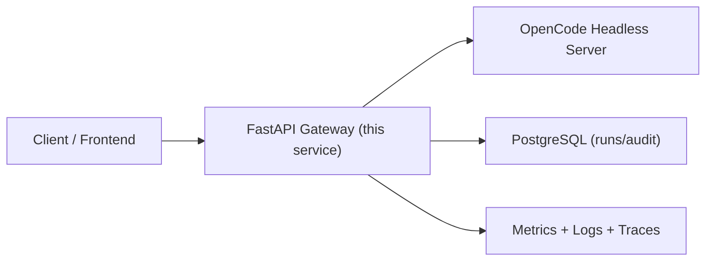

# Python FastAPI 设计计划（基于 OpenCode Headless）

本文档定义一个 Python FastAPI 编排层，用于调用 OpenCode 无界面服务（Headless）。

- OpenCode headless 运行说明：`docs/headless-service.md`
- OpenCode 权威 API 规范：`packages/sdk/openapi.json` 与运行时 `GET /doc`

## 1. 整体规划

### 1.1 目标

- 提供稳定的业务 API（鉴权、审计、统一错误、版本治理）。
- 统一编排 OpenCode 的会话执行、事件流、权限应答。
- 对上游（前端/其他后端）暴露固定契约，屏蔽 OpenCode 细节变化。


## 1.2 总体架构



### 1.3 职责边界

- FastAPI 服务负责：鉴权、输入校验、统一错误、审计、版本治理、对 OpenCode 的编排与协议适配。
- OpenCode 服务负责：Agent 推理、工具调用、session 生命周期、SSE 事件、permission/question 机制。

## 2. 代码组织（Bigger Applications）

```text
app/
  main.py
  core/
    config.py
    logging.py
    errors.py
    security.py
    request_id.py
  api/
    router.py
    v1/
      endpoints/
        runs.py
        approvals.py
        catalog.py
        health.py
  schemas/
    common.py
    error.py
    run.py
    approval.py
    catalog.py
  services/
    run_service.py
    approval_service.py
    catalog_service.py
  repos/
    run_repo.py
    audit_repo.py
  clients/
    opencode_client.py
  db/
    base.py
    session.py
    models.py
```

## 3. 分层设计细则

### 3.1 router（API 层）

- 只做：参数校验、`Security` 鉴权、调用 service、声明 `response_model`。
- 禁止：业务规则、OpenCode 调用细节、SQL 操作。

### 3.2 service（应用层）

- 编排：`create session -> prompt -> stream event -> persist summary`。
- 处理：业务状态机、错误映射、超时、重试、幂等。
- 可单测：通过 mock repo/client 做纯逻辑测试。

### 3.3 repo（数据访问层）

- 仅持久化：`runs`, `run_events`, `approval_actions`, `audit_logs`。
- 不做业务判断。

### 3.4 schema（DTO/contract）

- API 入参出参全部 Pydantic 模型。
- 不暴露 ORM 对象。

## 4. API 设计（本 FastAPI 服务）

前缀：`/api/v1`

### 4.1 统一成功与错误契约

- 成功：`{ "data": ..., "request_id": "..." }`
- 失败：

```json
{
  "error": {
    "code": "USER_NOT_FOUND",
    "message": "User not found",
    "request_id": "..."
  }
}
```

### 4.2 核心端点

1. `POST /api/v1/runs`
创建一次执行（内部可新建 OpenCode session 并发送 prompt）。
`scope`: `runs:write`

2. `GET /api/v1/runs/{run_id}`
查询运行状态与结果摘要。
`scope`: `runs:read`

3. `GET /api/v1/runs/{run_id}/events`（SSE）
订阅标准化后的事件流。
`scope`: `runs:read`

4. `POST /api/v1/runs/{run_id}/abort`
中止运行。
`scope`: `runs:abort`

5. `GET /api/v1/catalog/agents`
列出可用 agent。
`scope`: `catalog:read`

6. `GET /api/v1/catalog/skills`
列出可用 skill。
`scope`: `catalog:read`

7. `POST /api/v1/approvals/permission/{request_id}`
回复 OpenCode permission 请求（once/always/reject）。
`scope`: `approvals:write`

8. `POST /api/v1/approvals/question/{request_id}`
回复 OpenCode question 请求。
`scope`: `approvals:write`

9. `GET /api/v1/health/live` 与 `GET /api/v1/health/ready`
存活与就绪检查。

### 4.3 与 OpenCode API 的映射

- `POST /api/v1/runs` -> `POST /session` + `POST /session/{sessionID}/message`
- `GET /api/v1/runs/{id}/events` -> `GET /event`（按 `sessionID` 过滤）
- `POST /api/v1/runs/{id}/abort` -> `POST /session/{sessionID}/abort`
- `GET /api/v1/catalog/agents` -> `GET /agent`
- `GET /api/v1/catalog/skills` -> `GET /skill`
- `POST /api/v1/approvals/permission/{request_id}` -> `POST /permission/{requestID}/reply`
- `POST /api/v1/approvals/question/{request_id}` -> `POST /question/{requestID}/reply`

OpenCode 详细字段不在本文重复维护，以 `packages/sdk/openapi.json` 为准。

## 5. 版本与弃用策略

### 5.1 版本规则

- 破坏性变更必须升主版本：`/api/v1` -> `/api/v2`。
- 非破坏性变更可在同版本追加字段（保持向后兼容）。

### 5.2 pre-GA 弃用窗口（当前）

- 公告期：14 天
- 迁移期：14 天
- 移除期：14 天

文档与 OpenAPI 中标记 `deprecated`，响应头附加 `Deprecation` 与 `Sunset`。

## 6. 全局异常与错误处理

### 6.1 异常分类

- `DomainError`：业务错误（4xx）
- `AuthError`：认证鉴权错误（401/403）
- `DataAccessError`：存储访问错误（5xx 或 409/422）
- `UpstreamError`：OpenCode 上游错误（映射 4xx/5xx）
- `Exception`：未知错误（500）

### 6.2 实施要求

- 全局 `exception_handler` 统一输出 `Error Envelope`。
- 中间件链统一注入 `request_id`。
- 后台任务异常必须自行捕获、记录、告警，不尝试回写 HTTP 响应。

## 7. Lifespan 与依赖注入

### 7.1 Lifespan 初始化资源

- PostgreSQL 连接池 / AsyncSessionFactory
- `httpx.AsyncClient`（连接 OpenCode）
- 可选：Redis（仅当需要分布式锁/缓存）

### 7.2 Depends/Security 注入

- `get_current_user`：解析 JWT
- `require_scopes`：按端点 scope 校验
- `get_db_session`
- `get_opencode_client`
- `get_request_id`

## 8. 可观测性设计

### 8.1 请求标识

- 优先使用上游 `X-Request-Id`。
- 缺失时自动生成并回传响应头。

### 8.2 结构化日志字段（最少）

- `request_id`
- `trace_id`
- `user_id`
- `tenant_id`（V1 可为空）
- `latency_ms`
- `status_code`
- `path`
- `method`

### 8.3 指标建议

- `http_requests_total` / `http_request_duration_ms`
- `opencode_upstream_latency_ms`
- `run_active_count`
- `run_error_total`

## 9. 性能与并发模型

- I/O 路径全 async（FastAPI + httpx + async DB）。
- CPU 密集任务不在 API 进程执行。
- SSE 透传使用流式响应，不将全量事件缓存在内存。
- 文件上传下载使用流式处理（`UploadFile` / chunked）。
- 核心任务不使用进程内 background task 持久执行。

## 10. 安全基线

### 10.1 认证与授权

- 认证：Bearer JWT（服务间或用户态均可，统一 token 校验）。
- 授权：OAuth2 scopes，端点级声明：
  - `runs:write`
  - `runs:read`
  - `runs:abort`
  - `approvals:write`
  - `catalog:read`

### 10.2 常见安全控制

- Pydantic 严格校验 Query/Path/Body（长度、枚举、正则）。
- 敏感字段脱敏日志（token、password、authorization）。
- CORS/TrustedHost/HTTPS Redirect 由入口网关统一控制（应用内保持最小配置）。
- 限流优先放网关。
- OpenCode sidecar 必须启用 Basic Auth，凭据走密钥管理系统。

## 11. 数据模型（最小）

### 11.1 `runs`

- `id` (uuid)
- `session_id` (string)
- `status` (`created|running|waiting_approval|succeeded|failed|aborted`)
- `project_dir`
- `agent`
- `prompt_digest`
- `result_summary`
- `error_code`
- `error_message`
- `created_at` / `updated_at`
- `created_by`
- `tenant_id`（可空，预留）

### 11.2 `approval_actions`

- `id`
- `run_id`
- `request_id`
- `type` (`permission|question`)
- `action` (`once|always|reject|reply`)
- `actor`
- `created_at`

## 12. 测试策略

- 单测：service 层（mock repo + mock opencode client）。
- 集成测试：FastAPI TestClient + 测试库 + OpenCode server。
- 合约测试：校验 OpenAPI schema 与错误 envelope。
- 回归场景：
  - 正常执行到 `session.status=idle`
  - permission 阻塞并应答后继续
  - question 阻塞并应答后继续
  - 上游超时/断连
  - abort 生效

## 13. 里程碑建议

1. M1（基础可用）
`runs + events + approvals + catalog + auth + error envelope + request id`

2. M2（稳定性）
`审计日志、重试策略、指标完善、压测`

3. M3（扩展）
`多租户、应用内兜底限流、异步队列执行模式`

